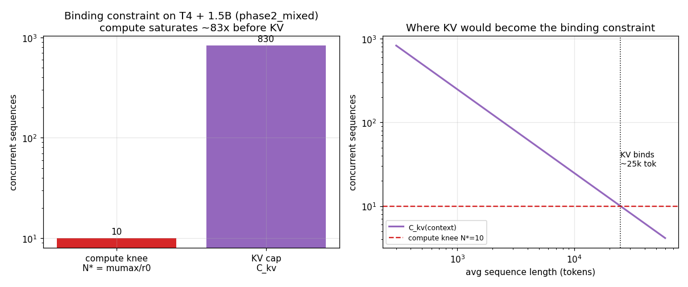
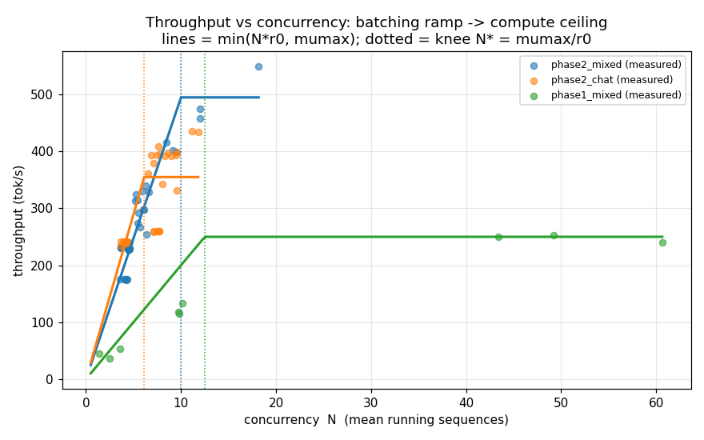
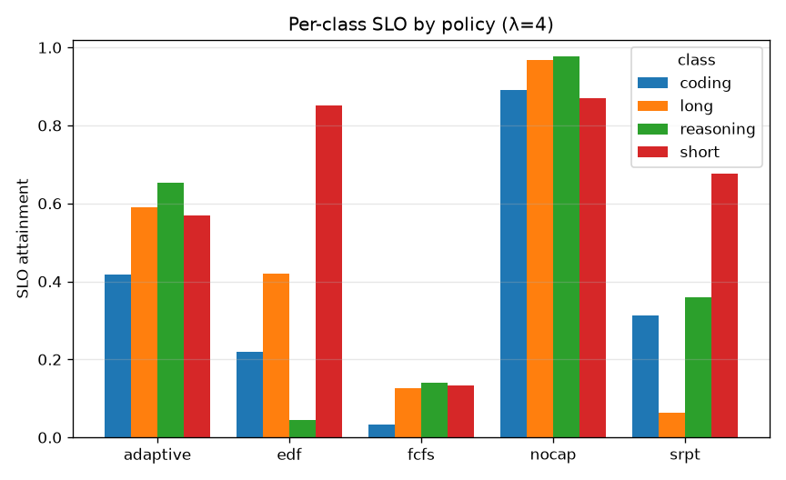
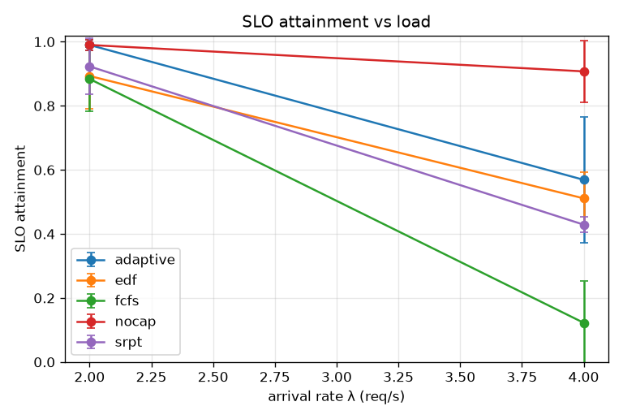

# LLM Inference Scheduling on vLLM

Adaptive **admission/ordering scheduling** for multi-tenant LLM inference, measured on a single
NVIDIA T4, with a queueing model that explains the results. This is a **research characterization**,
not a production system: one GPU, small models, and a scheduling layer **in front of an unmodified
vLLM** (we never modify vLLM's internal batcher).

**Full write-up:** [`report/report.md`](report/report.md).

## Results at a glance

<table>
<tr>
<td width="50%"><br><sub><b>The binding constraint is compute, not KV.</b> Derived KV cap ≈830 concurrent seqs vs a compute knee N*≈10 — compute saturates ~83× sooner. KV would only bind at ~25k-token sequences.</sub></td>
<td width="50%"><br><sub><b>All five policies collapse onto one throughput(N) law.</b> Continuous batching ≈ M/G/1 processor sharing: a linear batching ramp to a compute ceiling, with the knee N*=μmax/r0 derived from first principles.</sub></td>
</tr>
<tr>
<td width="50%"><br><sub><b>Where the scheduler earns its place: differentiated service.</b> Under overload EDF protects the urgent class, SRPT starves long jobs, adaptive keeps every class alive — control that admit-all cannot offer.</sub></td>
<td width="50%"><br><sub><b>The honest null result.</b> On aggregate SLO, no capped policy beats admit-all on a single T4 — capping concurrency costs the throughput that meets deadlines.</sub></td>
</tr>
</table>

## Headline results

- **On a single T4, no admission policy beats admit-all on aggregate SLO** — capping concurrency costs
  up to **−42 % throughput**, and on this hardware throughput is what meets deadlines. A rigorously
  measured null result.
- **The scheduler's real value is differentiated service under overload:** `edf` protects the urgent
  class (short-job SLO 0.85 while reasoning drops to 0.04), `srpt` protects short jobs but starves long
  ones, `adaptive` keeps every class alive. `fcfs` suffers the convoy collapse (SLO 0.12). Admit-all
  looks great on aggregate but offers **zero control** over who suffers.
- **Output-length prediction barely matters** for SRPT here: a free prompt-length proxy (SLO 0.462)
  matches a learned predictor (0.441) and beats even a true-length oracle (0.376).
- **The system is compute-bound, not KV-bound:** derived KV cap ≈ 830 concurrent seqs vs a compute
  knee N\* ≈ 10 — **compute saturates ~83× before KV.** KV would only bind at ~25k-token sequences.
- **A queueing model explains it all:** continuous batching ≈ M/G/1 processor sharing with a
  load-dependent service rate; all five policies collapse onto one `throughput(N)` curve, confirming
  the scheduler is an admission layer, not a change to the service process.

## Stack

- Python 3.11, [`uv`](https://github.com/astral-sh/uv) for envs. Serving: **vLLM 0.8.5.post1**.
  GPU telemetry: **DCGM** (SM/DRAM-active) + **NVML** (power) + vLLM `/metrics` (KV, queue, spec counters).
- Hardware: **NVIDIA T4 (16 GB, Turing)** — a data-center GPU, so DCGM profiling fields work. Linux/WSL2.
- Model: **Qwen/Qwen2.5-1.5B-Instruct**, off-the-shelf **n-gram speculative decoding** (no draft training).

## Reproduce

```bash
# 1. Environment
uv venv --python 3.11 && source .venv/bin/activate
uv pip install -r requirements.txt

# 2. Start the vLLM server (T4 requires --dtype float16; Turing has no hardware bf16)
vllm serve Qwen/Qwen2.5-1.5B-Instruct --dtype float16 \
  --speculative-config '{"method":"ngram","num_speculative_tokens":4,"prompt_lookup_min":2,"prompt_lookup_max":5}' \
  --port 8000

# 3. Run experiments (each writes one JSON per run to results/, plus summaries + figures)
python harness/run.py     --config configs/phase1_mixed.yaml    # measurement harness sweep
python scheduler/run.py    --config configs/phase2_mixed.yaml    # policy comparison (mixed)
python scheduler/run.py    --config configs/phase2_chat.yaml     # policy comparison (chat)
python scheduler/run.py    --config configs/phase2_mixed.yaml --experiment predictor
python model/model.py     --config configs/phase3_model.yaml    # queueing model + figures (offline)

# Or run the whole pipeline end-to-end (thermally gated; needs the GPU + running server):
bash reproduce.sh
```

`model/model.py` is **offline** (no GPU/server needed) — it re-fits the model and regenerates
the Phase-3 figures from `model/measured_runs.csv`.

## Repository layout

```
common/            shared package: config, telemetry samplers, metrics aggregation, plotting
configs/           one YAML per experiment (no magic numbers in scripts)
baseline/          vLLM + telemetry smoke test
harness/           open-loop Poisson loadgen + measurement harness
scheduler/         admission scheduler + policy comparison
model/             M/G/1-PS + capacity model (offline analysis)
report/            report.md — the full write-up
results/summaries/ committed summaries (.md) + fitted constants (.json) — the artifacts of record
results/figures/   committed figures (.png)
```

The pipeline runs in order: `baseline → harness → scheduler → model → report`.

## Conventions

- **Every run** writes one JSON in a fixed schema; **always p50 AND p99**, never just the mean.
- **Warm up before measuring** — the first ~30 s / warmup requests of every run are discarded.
- **Thermally gated:** on the passively-cooled T4, runs wait for the GPU to cool below 77 °C before
  measuring, because throttling above ~85 °C corrupts timings.
- Telemetry: vLLM `/metrics` is the primary live signal; DCGM for utilization (**not** nvidia-smi's
  "GPU-util"); NVML for power only.
- Raw per-run JSONs are git-ignored; committed `results/summaries/` and `results/figures/` are the
  record.

## Boundary (stated plainly)

Single GPU, small (1–3B) models, admission/ordering layer only. Multi-tenancy is simulated as multiple
request streams on one vLLM instance. Off-the-shelf n-gram drafts — **no draft training**. The
aggregate result is largely a measured null result; the demonstrated contribution is differentiated
service and convoy avoidance under overload, plus a queueing model that explains where each regime
begins. We do not claim to beat production serving systems.
